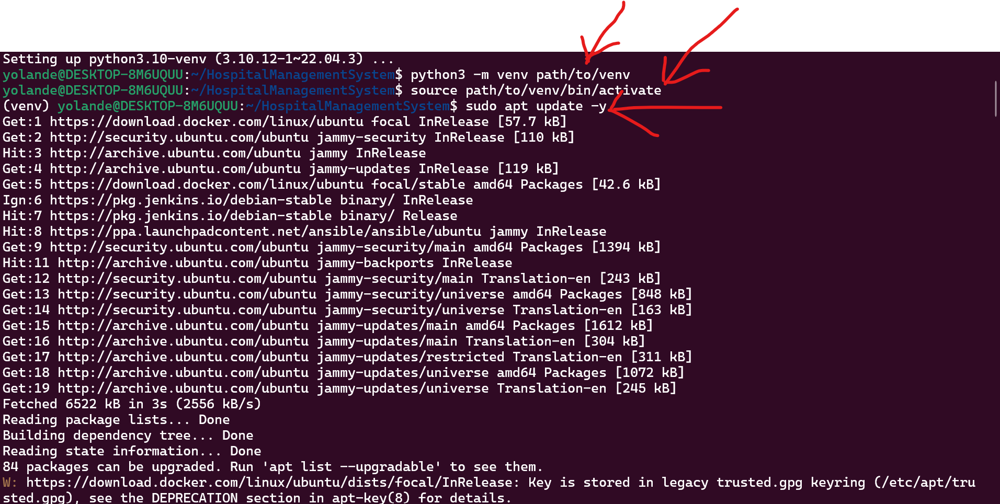

# python-projet
This repository explain step by step how to implement a python application on the local host  
---

### Getting Started

Follow the installation steps to open project without error

 INSTALLATION 

1- Download and extract the project

NOTE: I've used virtual environment. It's not necessary, but using virtual environment is preferable

2- Run this projet on your local host (you don't to create a VM )

3- Clone the repository and cd into it
*      git clone https://github.com/Arlette-Yolande/HospitalManagementSystem.git

*       cd HospitalManagementSystem

4- You may need to install python3
*       sudo apt install python3.10-venv

5- Created the virtual environment

*      python3 -m venv path/to/venv

6- Activate the virtual environment:

*      source path/to/venv/bin/activate

*       sudo apt update

7- Install all the required libraries for the application

*       pip install -r requirements.txt

8- To run the code
*          flask run

9- Copy the URL paste on a new tab

10- You can veiw your application

*   create a username and a password and longin

Thats it..!!

